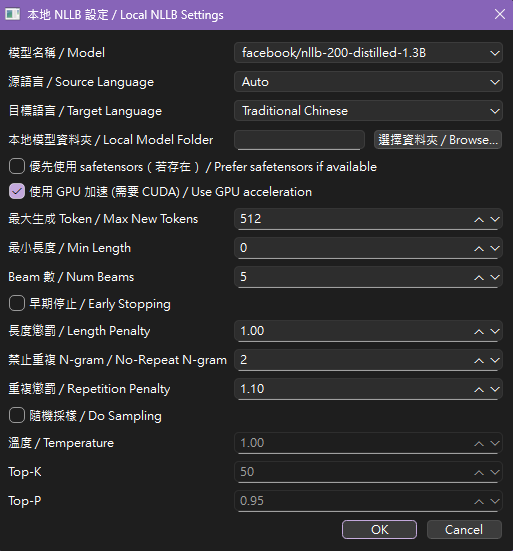

# Local and API translator

## Project Preview

This is a desktop application for Optical Character Recognition (OCR) and text translation, supporting multiple languages and modes.
It uses PaddleOCR for text detection and recognition, and integrates translation via local NLLB models or external APIs like Gemini and DeepL.
The tool features a PyQt6-based GUI for easy screenshot capture, OCR processing, and translation.
Ideal for users needing quick text extraction and translation from images, such as screenshots or documents.

Key technologies: Python, PyQt6, PaddleOCR, Transformers (for NLLB), Requests (for APIs).

## Feature

- Screenshot Capture: Select and capture screen regions for OCR.
- OCR Processing: Detect and recognize text in images using PaddleOCR v5, with configurable parameters like language and thresholds.
- Translation:
  - Local mode: Uses Facebook's NLLB-200 models (distilled variants: 600M, 1.3B, 3.3B) for offline translation.
  - API mode: Integrates with Gemini (for OCR + translation) or DeepL (for translation after local OCR).
- Supports source language auto-detection and target languages like English, Japanese, Simplified/Traditional Chinese.
- GUI Interface: User-friendly interface with text display, copy/clear buttons, history logs, and settings menus.
- History and Logging: Maintains OCR and translation history; detailed logging for debugging.
- Configurable Settings: Adjust OCR parameters (e.g., CPU threads, box thresholds) and translation configs (e.g., beams, temperature).
- Save Options: Optionally save captured images with timestamps.

## Installation

### Prerequisites

Python 3.12+

### Step

1. Clone the repository:

   ```bash
   https://github.com/NitanCos/local_translator.git
   ```

2. Navigate to the project directory:

   ```bash
   cd local_translator/CPUver
   ```

3. Install dependencies:

   ```bash
   pip install -r requirements.txt
   ```

4. For NLLB models:

   (HTTP)

   ```bash
   # Select the model you want install
   # Make sure git-lfs is installed (https://git-lfs.com)
   git lfs install
   git clone https://huggingface.co/facebook/nllb-200-distilled-600M
   git clone https://huggingface.co/facebook/nllb-200-distilled-1.3B
   git clone https://huggingface.co/facebook/nllb-200-3.3B
   ```

   (CLI)

   ```bash
   # Select the model you want install
   # Make sure hf CLI is installed: pip install -U "huggingface_hub[cli]"
   hf download facebook/nllb-200-distilled-600M
   hf download facebook/nllb-200-distilled-1.3B
   hf download facebook/nllb-200-3.3B
   ```

5. For PaddleOCR:

   ```bash
   # Needed models will put inside
   cd local_translater/models/paddleocr
   ```

### Run

```bash
python main.py
```

## Usage Step

   1. Setup the Local Translator model (if you just want to use the API mode, select Cancel)  

      The meaning of parameters can find in **[reference.txt](./CPUver/reference.txt)**
      <p align="left"></p>
   2. Select Mode (and enter the API Key)
      <p align="left"></p>
      <p align="left"></p>
   3. Setup the OCR model and parameters (except use Gemini API. Gemini API will use own OCR to recognize text.)
      <p align="left"></p>
      please fill in the OCR model directory:  

      ```text
      ./models/paddleocr
      ```

      The meaning of parameters can find in **[reference.txt](./CPUver/reference.txt)**
   4. Start Translate (GUI view)
      <p align="left"></p>

## Acknowledgments

- PaddleOCR for OCR engine.
- Hugging Face Transformers for NLLB models.
- Google Gemini and DeepL for API integrations.
- PyQt6 for GUI framework.
